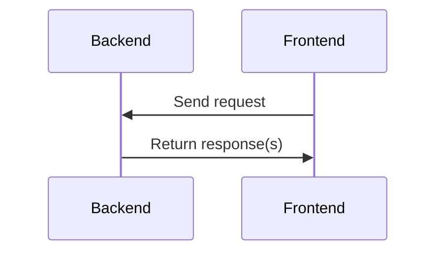

# CLAUDE.md

本文件为 Claude Code (claude.ai/code) 在此代码库中工作时提供指导。

## 项目概述

**nftools** 是一个使用 Flutter (前端) 和 Rust (后端) 构建的跨平台 GUI 桌面应用程序，支持 Windows 和 Linux 平台。应用程序提供了显示器管理、文件同步、系统监控和 AI 对话功能。

## 架构

### 技术栈
- **前端**: Flutter 3.4+ 使用 Fluent UI 主题
- **后端**: Rust 使用异步运行时 (Tokio)
- **通信**: Rinf 框架用于 Flutter-Rust 互操作
- **状态管理**: GetX 模式
- **路由**: GoRouter
- **平台支持**: Windows 11/10, Linux (Arch KDE Plasma 6)

### 通信模式
应用程序使用 `Rinf` 进行前后端通信。`Rinf` 提供流式通信，被封装成类似 HTTP 的请求-响应模式：




## 构建命令

### 开发环境设置
```bash
# Generate Rinf bindings (required after any protocol changes)
dart run enhance_rinf.dart

# Manual protobuf generation (if needed)
dart pub global activate protobuf 4.0.0
protoc --dart_out=lib/ ./messages/*.proto
```


### Flutter 命令
```bash
# 安装依赖
flutter pub get

# 运行开发版本
flutter run

# 构建发布版本
flutter build windows --release    # Windows
flutter build linux --release      # Linux

# 分析代码
flutter analyze

# 运行测试
flutter test

# 清理构建
flutter clean
```


### Rust 命令
```bash
# 安装依赖
cargo build

# 运行开发版本
cargo run

# 构建发布版本
cargo build --release

# 检查代码
cargo check

# 运行测试
cargo test

# 格式化代码
cargo fmt

# 代码检查
cargo clippy
```


### 跨平台依赖

#### Linux 依赖 (Arch Linux)
```bash
sudo pacman -S cmake ninja libayatana-indicator libdbus-sys liblzma
```


#### Windows 依赖
- Visual Studio with C++ support
- Windows SDK

## 项目结构

### 前端 (`lib/`)
- `api/` - API 接口定义和基础功能
- `controller/` - 使用 GetX 模式的 MVC 控制器
- `pages/` - UI 页面 (主页、显示、文件同步、AI 对话)
- `router/` - 使用 `GoRouter` 的导航配置
- `common/` - 共享常量、全局状态和样式
- `utils/` - 工具组件和辅助函数
- `src/bindings/` - 生成的 `Rinf` 绑定

### 后端 (`native/hub/`)
- `src/` - Rust 源代码
    - `api/` - API 服务实现
    - `common/` - 共享工具和全局数据
    - `dbus/` - 用于 Linux 的 D-Bus 集成
    - `messages/` - 协议缓冲区定义
    - `service/` - 业务逻辑服务

## 主要功能

### 显示器管理
- 通过 DDC 协议控制显示器亮度
- 系统主题切换 (浅色/深色模式)
- 系统电源管理 (防止休眠、保持唤醒)

### 文件同步
- 基于 WebDAV 的文件同步
- 与云服务集成 (坚果云/JianGuoYun)
- 文件夹同步及冲突解决

### 系统监控
- CPU 和内存使用率监控
- 历史数据 (最多 48 小时)

### AI 对话
- 集成中文 AI 模型 (百度 Yi-34B, 星火 Spark-Lite)

## 重要说明

### 开发工作流程
1. 修改协议后始终运行 `dart run enhance_rinf.dart`
2. `enhance_rinf.dart` 脚本会自动为生成的类添加 `ApiSerializable` mixin
3. 使用 `lib/api/` 中定义的现有 API 模式开发新功能
4. 遵循 GetX 模式进行状态管理和依赖注入

### 平台特定代码
- 通过 `ddc-winapi` 实现 Windows 特定的显示控制
- 通过 D-Bus 集成实现 Linux 特定的系统控制
- 在 Rust 后端使用 `cfg(windows)`/`cfg(unix)` 进行条件编译

### 错误处理
- 具备完善的错误处理机制并提供用户友好的消息
- 控制器中的全局异常处理
- 使用 `simple-log` 实现带文件轮换的日志系统

### 内存管理
- 使用 MiMalloc 提升内存分配性能
- 正确的资源清理和锁文件管理
- 线程安全的全局状态管理

## 测试
- `test/` 目录中有基本的测试设置
- 可用的 UI 组件 widget 测试
- 目前尚未实现全面的测试套件

## 配置文件
- `pubspec.yaml` - Flutter 依赖和项目配置
- `Cargo.toml` - Rust 工作区和依赖管理
- `enhance_rinf.dart` - 用于 `Rinf` 代码生成和 API 增强的构建脚本
- `analysis_options.yaml` - Dart 分析规则