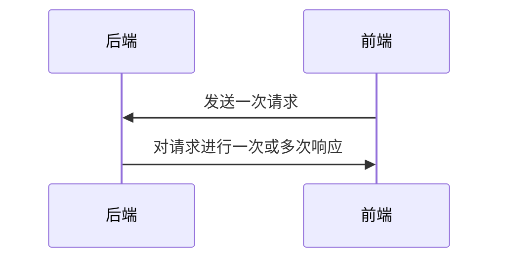

# nftools

[toc]

一个杂七杂八的GUI工具。

## 介绍

这是一个包含杂七杂八的图形化工具。支持`windows`和`linux plasma6`桌面。

以下是主要支持的平台（因为我只有这两种设备）：

| 平台                   | 支持性 | 测试   |
| ---------------------- | ------ | ------ |
| windows 11             | 主力   | 已测试 |
| archlinux kde plasma 6 | 主力   | 已测试 |
| windows 10             | 兼容   | 未测试 |

## 功能

以下为当前包含功能：

- `显示工具`
- `文件同步`
- `系统监控`
- `AI 对话`

### 显示工具


#### 显示器亮度

此处可以调节外接显示器的亮度。仅支持`ddc`协议。

`linux`需要配置`ddc`,可以参考 [External monitors](https://wiki.archlinux.org/title/Backlight#External_monitors) 和 [Linux 下调节外接显示器亮度的方法](https://www.meow-2.com/posts/linux/linux-ddcci)。

#### 主题

此处可以调整系统使用`亮色模式`还是`暗色模式`，高亮选项表示系统当前的模式。

#### 系统休眠

此处可以控制系统的电源状态。只有打开`阻止系统休眠`才可以调节是否`保持亮屏`。

状态描述：

- `阻止系统休眠` 关闭：使用系统的电源模式。此时`保持亮屏`选项无效。
- `阻止系统休眠` 打开 + `保持亮屏` 关闭： 系统会自动锁屏，也允许屏幕自动熄灭，但系统不会进行自动待机，而是处于一直运转状态。此功能可以用于有长时间任务运行。
- `阻止系统休眠` 打开 + `保持亮屏` 打开： 不允许系统自动锁屏，屏幕会保持常亮。

### 文件同步


此功能使用`webdav`进行文件同步。这里使用`坚果云`的`webdav`进行文件同步。

#### 账户管理


坚果云账户可以参考：[坚果云第三方应用授权WebDAV开启方法](https://help.jianguoyun.com/?p=2064)，其它`webdav`服务请参考服务的相关文档。

以下为坚果云的举例：

- 服务器地址：`https://dav.jianguoyun.com/dav/`
- 账户： 输入对应账户
- 密码： 输入创建好的应用密码（**注意：这里不是坚果云自己的密码，而是第三方应用管理的密码**）

#### 新增文件夹


这里新增需要同步的文件夹。

- 标签：输入一个标签，便于在其它设备同步。
- 文件地址：点击选取一个要同步的文件夹。

#### 同步


列表描述：

- 操作：这里可以进行同步，依赖状态字段。
  - 同步：如果已是最新状态，则无法点击；点击后进行上传或下载。
  - 删除：删除远端已同步的信息，即取消今后对这个文件夹的同步，但**不会删除本地文件**。
- 本地：表示要同步的本地文件夹
- 标签：创建同步时输入的标签，便于管理
- 状态：含：`已同步`、`待下载`、`待上传`等情况。
- 新增：表示此次操作需要远端或本地新增文件数量
- 删除：表示此次操作需要远端或本地删除文件数量
- 变更：表示此次操作需要远端或本地变动文件数量

**注意**：由于文件同步并不使用版本机制，而是依赖时间戳进行检测。如果存在以下情况，可能会导致文件更改丢失：

1. 在设备A提交进行一次提交 （远端的时间戳为此次提交的时间戳）

2. 之后，设备B已经有一份数据，但在未进行更新版本情况下，对某个文件修改（设备B的时间戳比远端更大），此时，将会认为设备B的文件是最新的，同步将直接上传，设备A对该文件的改动会被覆盖。

**强烈建议**每次修改前，先进行一次最新同步。

#### 刷新

这个按钮会对要同步的所有文件夹进行一次状态重新检测。

### 系统监控


此功能用于查看系统`cpu`和`内存`使用率，最大时间可以查看`48h`之前的数据。

### AI对话

此功能对接了百度`Yi-34B`和星火`Spark-Lite`的免费AI文本大模型。

### 设置

这里是应用的设置。

## 开发介绍

技术栈：

- 前端：`flutter`
- 后端：`rust`
- 交互：使用链接库进行交互 `rinf`

主要使用`rinf`来进行前后端交互。`rinf`提供流式的从`flutter`到`rust`或`rust`到`flutter`的单向请求，所以本项目对`rinf`的单向请求进行封装，改变为类似`http`的`一次请求，一次响应`这种模式。



## 编译依赖

当前的编译依赖不完整。

### windows

### linux

```bash
cmake
ninja
libayatana-indicator (ayatana-appindicator3-0.1 or appindicator3)
libbus-sys
liblzma
```